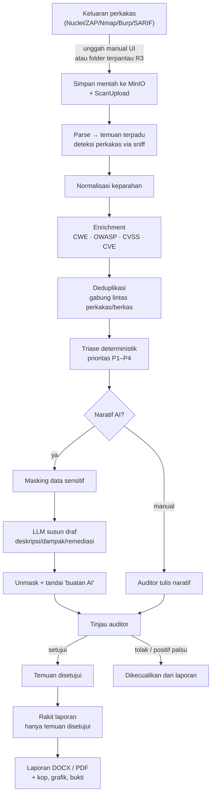
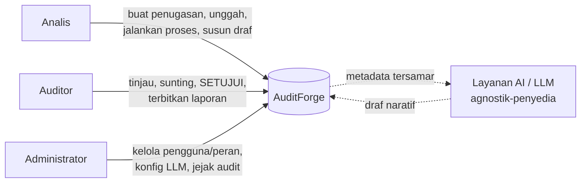
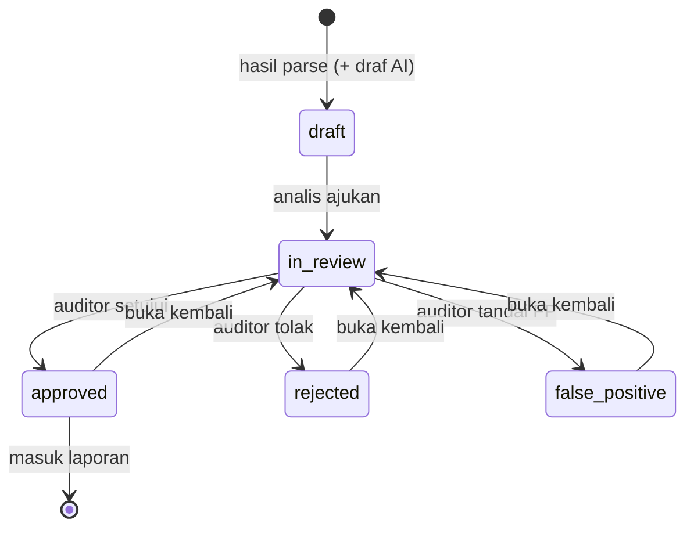
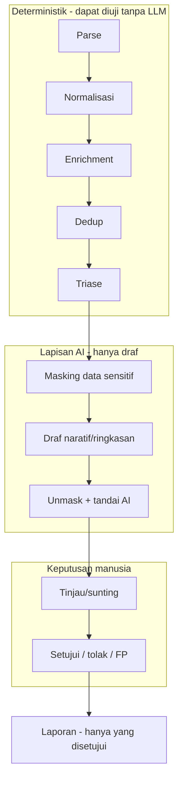
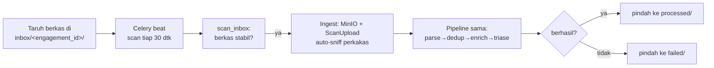
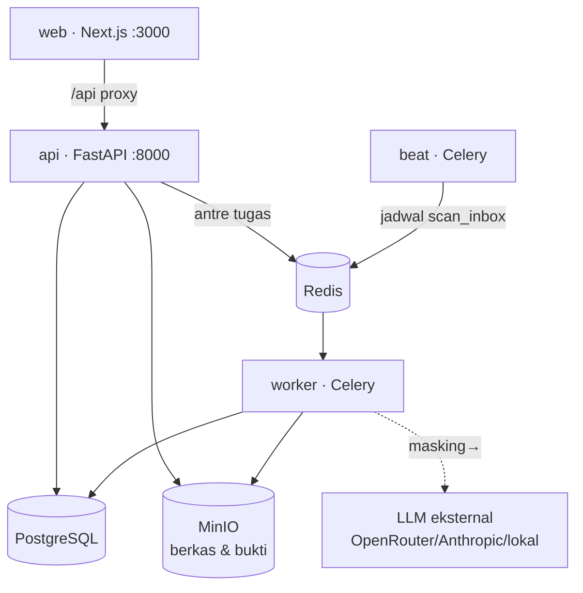

# Alur Aplikasi — AuditForge

Dokumen ini menjelaskan **alur kerja end-to-end** AuditForge: dari keluaran perkakas
pemindaian sampai laporan audit final. Prinsip yang mendasari seluruh alur:

> **AI hanya membuat draf. Auditor adalah pengambil keputusan akhir.**
> Semua tahap non-AI (parse, dedup, enrichment, triase, masking, perakitan laporan,
> metrik) bersifat **deterministik** dan teruji tanpa memanggil LLM.

AuditForge bekerja pada tahap **pascapengujian** — ia **tidak** memindai/mengeksploitasi
sistem apa pun.

---

## 1. Alur nilai utama (end-to-end)

**Ringkas per tahap:**

| # | Tahap | Sifat | Modul |
|---|---|---|---|
| 1 | Ingest berkas (unggah UI / folder terpantau) | Deterministik | `api/routes/engagements`, `ingest/watcher` |
| 2 | Parse → skema temuan terpadu | Deterministik | `parsers/` (5 perkakas + `sniff`) |
| 3 | Normalisasi keparahan | Deterministik | `normalize` |
| 4 | Enrichment (CWE/OWASP/CVSS/CVE) | Deterministik | `enrichment` |
| 5 | Deduplikasi (fingerprint, gabung) | Deterministik | `normalize` |
| 6 | Triase prioritas P1–P4 | Deterministik | `triage` |
| 7 | Draf naratif + ringkasan eksekutif | **AI** (+ masking) | `ai/narrative`, `ai/summary`, `ai/masking`, `ai/llm` |
| 8 | Tinjau · sunting · setujui | **Manusia** (auditor) | `review`, `models/finding` |
| 9 | Rakit & terbitkan laporan | Deterministik | `reporting/` (DOCX/PDF/HTML/charts) |
| 10 | Evaluasi terukur | Deterministik | `eval/engagement_eval` |

---

## 2. Peran & tanggung jawab

- **Analis** — menyiapkan penugasan, mengunggah keluaran perkakas, menjalankan pemrosesan,
  menyusun draf. **Tidak** boleh menyetujui.
- **Auditor** — meninjau, menyunting, **menyetujui/menolak/menandai positif palsu**,
  menerbitkan laporan. **Pemegang keputusan akhir.**
- **Administrator** — mengelola pengguna & peran, konfigurasi LLM (panel Admin), dan
  memantau jejak audit.

RBAC (fail-closed): status persetujuan (approved/rejected/false_positive) **hanya**
untuk auditor/admin; analis boleh menyunting & mengajukan.

---

## 3. Siklus status satu temuan

Setiap transisi & suntingan naratif tercatat di **riwayat versi** (`finding_revisions`) —
termasuk asal draf AI (model + versi prompt) vs suntingan auditor. Hanya temuan
**approved** yang masuk laporan.

---

## 4. Batas AI ↔ Manusia ↔ Deterministik

**Masking** menjamin data sensitif (IP internal, hostname, kredensial, email) **tak pernah
sampai ke LLM** — disamarkan jadi `[IP-INTERNAL-1]`, `[HOST-1]`, `[SECRET-1]`, … lalu hasil
AI dipulihkan (unmask) di server. Untuk data sangat rahasia, Base URL LLM dapat diarahkan
ke model lokal/on-premise sehingga tidak ada data yang keluar.

---

## 5. Auto-ingest folder terpantau (R3)

Alternatif tanpa unggah manual — auditor cukup menaruh berkas di folder terpantau:

Berkas yang baru ditulis (< 5 dtk) dilewati agar tak mengurai berkas separuh. Temuan masuk
ke pipeline dedup/enrichment/triase yang **sama** dengan unggah manual.

---

## 6. Arsitektur runtime (layanan)

Semua dikemas dalam satu `docker-compose.yml` dan berjalan **on-premise**. Frontend
mem-proxy `/api/*` ke backend (same-origin) sehingga hanya port 3000 yang perlu diekspos.

---

## 7. Ringkasan

AuditForge mengubah keluaran perkakas mentah menjadi laporan audit yang **deterministik,
tertelusuri, dan diputuskan manusia** — dengan AI mempercepat penyusunan naratif tanpa
pernah menggantikan penilaian auditor. Lihat `README.md` untuk cara menjalankan dan
`DPPL_AuditForge.tex` / `DUPL_AuditForge.tex` untuk perancangan & kebutuhan rinci.
